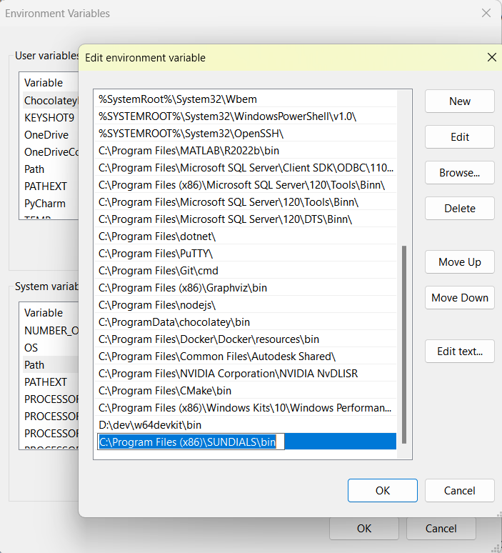
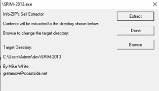
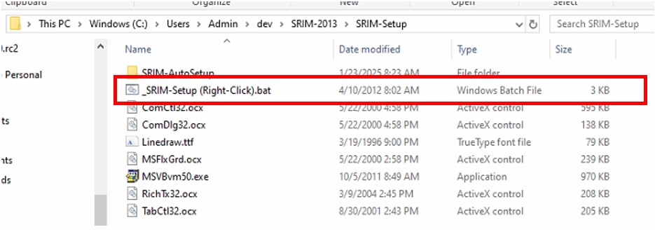
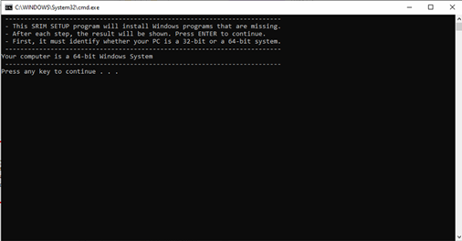
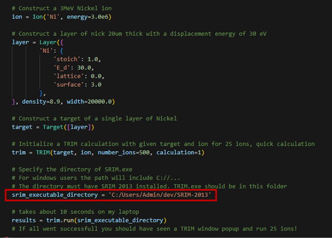

# Overview
This codebase solves a system of ODEs using the [CVODE](https://sundials.readthedocs.io/en/v6.5.1/cvode/index.html) package from [SUNDIALS](https://sundials.readthedocs.io/en/v6.5.1/index.html). For maximum efficiency, the C++ executable is a standalone ODE solver. Reading data from the Excel file and plotting the results are managed through Python packages (Pandas, Matplotlib).

`main.py` calls a subprocess (C++ executable) passing the read data as a command line argument. The C++ executable solves the ODEs, evaluates the state at the given time points, and prints the results to the console. A utility function in Python processes the console output and saves the integration results into a Numpy array.

<br>

# Preparation
## 1. Installing SUNDIALS
1. Download a release of SUNDIALS [here](https://computing.llnl.gov/projects/sundials/sundials-software). Installation instructions are found [here](https://sundials.readthedocs.io/en/v6.5.1/Install_link.html#building-from-the-command-line)
2. Uncompress the downloaded .gz file. 
    ```
    tar -xzf sundials-7.0.0.tar.gz 
    ```

## 2. Building SUNDIALS
1.  On Linux, use CMake to build the package. Navigate to the `build` directory inside the expanded folder and execute the following lines to build the package.
    ```
    cmake ..
    make 
    sudo make install
    ```

2. On Windows, make sure [Visual Studio](https://visualstudio.microsoft.com/vs/community/) and [CMake](https://cmake.org/download/) are installed.

    1. Create a `build` directory inside the unzipped folder.
    2. Open Visual Studio **as adminstrator** and open a terminal.
    3. Cd to `build` and run:
        ```
        cmake-gui ..
        ```
        This should open a new CMake-gui window.
    4. Specify the source path and build paths. The source path should be the unzipped folder and build path should be the `build` directory.
    
    5. Click 'Configure' and click 'Generate'.
    6. By default, the Windows OS limits the maximum path length to 260 characters. This will lead to errors in the future steps. To enable long paths, we need to make changes to the Windows registry.
        * In the Run dialog (Win + R), type 'regedit'.
        * Navigate to HKEY_LOCAL_MACHINE\SYSTEM\CurrentControlSet\Control\FileSystem.
        * Find the entry named 'LongPathsEnabled' and set its value to '1'.
        * Restart the computer.
    7. In the previously opened terminal within `build`, run `msbuild ALL_BUILD.vcxproj` followed by `msbuild INSTALL.vcxproj`
    8. Open `ALL_BUILD.vcxproj` located in the `build` folder. Build -> Build All.
    9. Add the path to the installed SUNDIALS library to PATH. System Properties -> Enviornment Variables -> Click on PATH under System variables, add path to SUNDIALS.
        
   
    
## 2. Building the C++ Excutable
1. (Option 1) CMake

    Using the provided CMakeLists.txt, build the program by executing the following commands. This should create a ./main executable in the build folder:
    ```
    cd build
    cmake ..
    make
    ```
2. (Option 2) g++

    Alternatively, you can build the executable using g++:
    ```
    g++ main_spatial.cpp -o main -lsundials_cvode -lsundials_nvecserial -lsundials_core
    ```

## 3. Python dependencies
In a desired Python environment, install `numpy, pandas, matplotlib, openpyxl`.

## 4. Installing SRIM on Windows
1. Download SRIM-2013 from the [official website](http://www.srim.org/SRIM/SRIMLEGL.htm). 

2. Create a new directory named `SRIM-2013`


3. Move the previously downloaded `.e` file to the new directory and rename the file to `SRIM-2013.exe`.

4. Double click on the .exe file to begin extraction. Click `Extract` then `Done`.


5. If installing SRIM for the first time, go to the `SRIM-Setup` directory. There should be a file named `_SRIM-Setup (Right-Click).bat`. Right click on this file and Run as Admistrator.


6. Follow onscreen instruction displayed on the Command Window.


## 5. Installing SRIM on Ubuntu

## 6. Installing pysrim
1. Go to the pysrim repository [website](https://gitlab.com/costrouc/pysrim/-/tree/master), and download the repository as a `.zip` file.

2. Extract the `.zip` file.

3. In the root directory of the repository `pysrim-master`, execute the following command:
    ```
    pip install .
    ```

4. To verify installation, we will run a tutorial jupyter notebook. Open the following notebook

<br>

5. The path to the SRIM executable must be specified. This can be found in the second code cell.


6. If everything has been installed correctly, we should see a pop-up TRIM window when executable the second code cell of the tutorial.


# Running the ODE Solver
1. Run the main script in the correct Python environment. This calls the c++ excutable named `main` under `build`. Data is passed as a command line argument when calling the subprocess.
    ```
    python main.py
    ```
2. `./main_time` is a standalone exectuable with hardcoded loaded data.
    ```
    ./main_time
    ```

# Running the ODE Solver with Spatial Nodes
1. Run the main script in the correct Python environment. This calls the c++ excutable named `main_spatial` under `build`. Data is passed as a command line argument when calling the subprocess.
    ```
    python main_spatial.py
    ```

2. Code Walkthrough

<!-- # Results
Runtime comparisons between original Python code (scipy odeint) vs. C++ (SUNDIALS) with controlled absolute, relative tolerances.
> **C++**: 75.3078 ms
>
> **Python**:  361.270 ms -->
